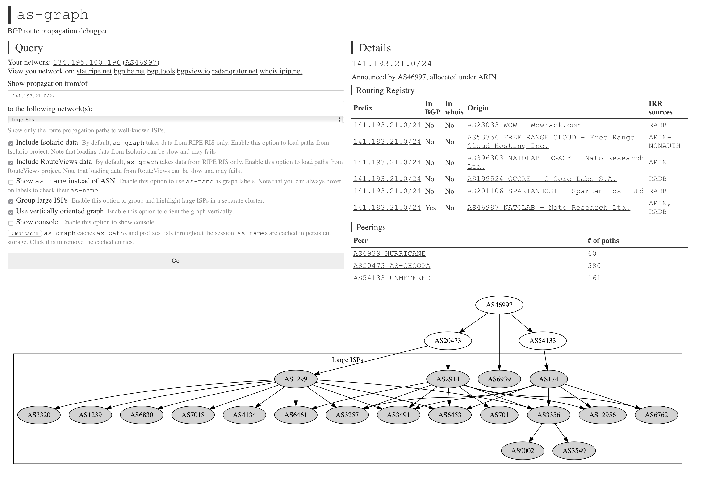

as-graph
---

A simple tool uses data from [RIPE RIS](http://ris.ripe.net), [Isolario](https://isolario.it) and [RouteViews](http://routeviews.org) to visualize route propagation with graphs similar to the ones on [bgp.he.net](https://bgp.he.net).

`as-graph` allows you to visualize your route propagation to one of these destinations in real-time:

- __Direct peers__: Directly connected peers.
- __Large ISPs__: Tier-1 ones and other major ISPs.
- __ISPs__: All transit ASes.
- __Everything__: All ASes.
- __Custom destnations__: Your own list of ASes.

To use it, visit [bgp.nat.moe](https://bgp.nat.moe/). Alternatively, clone this repo and open `index.html`.

You may specify ASN or IP address in the URL with a hash (e.g., [bgp.nat.moe/#AS46997](https://bgp.nat.moe/#AS46997)) to draw the graph on page load.

### License

The project is licensed under UNLICENSE (public domain). The RIPE RIS data subjects to [terms of use](https://www.ripe.net/analyse/internet-measurements/routing-information-service-ris/commercial-use), the RouteViews data is published under [CC-BY 4.0](https://creativecommons.org/licenses/by/4.0/), and [viz.js](http://viz-js.com) used by this project for visualizing is licensed under MIT license.